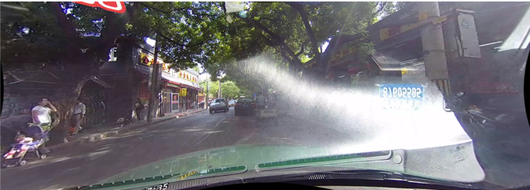
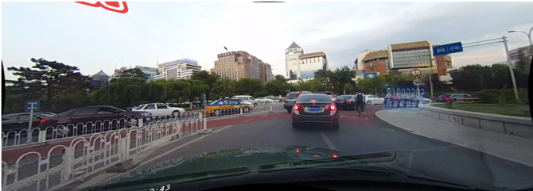
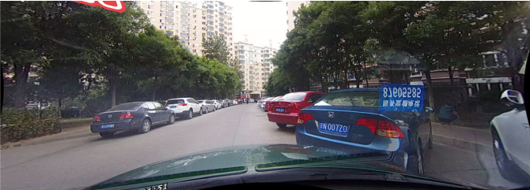
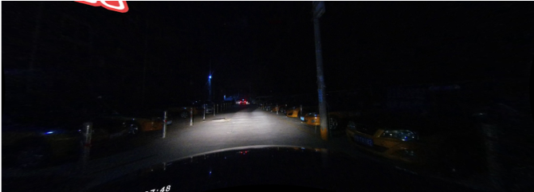
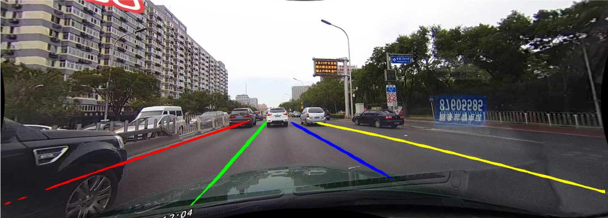
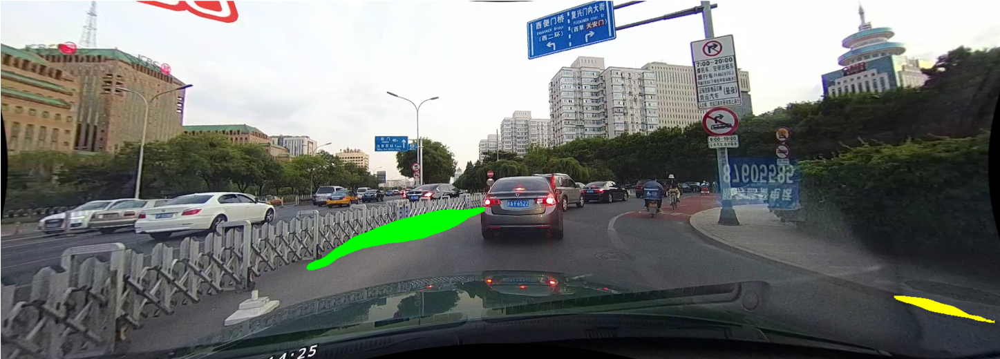
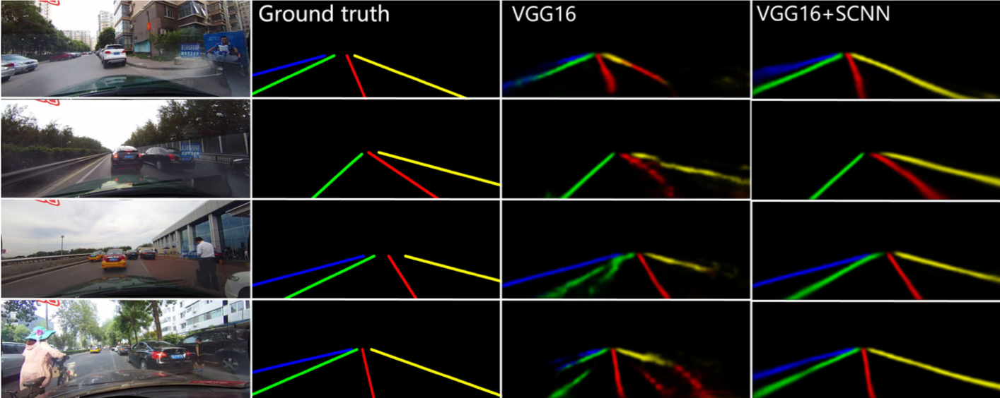
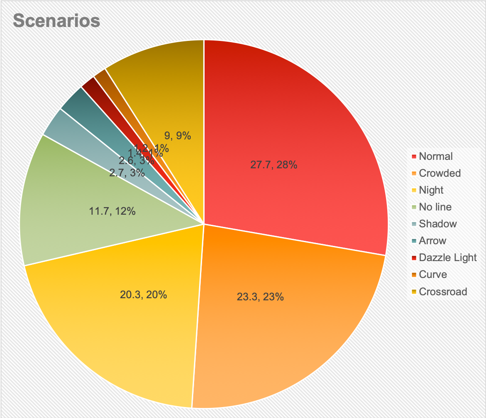
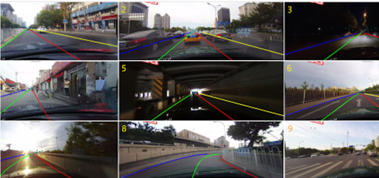
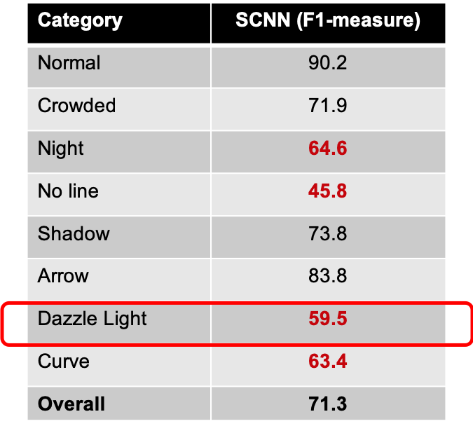

# What? Why? How?

## What?
### Lane Detection: 
In the project, we have tried to tackle the problem of lane detection in adverse conditions.

## Why?
What made us do this? What is the motivation behind tackling the problem of lane detection effectively?
Two major reasons are - 
1. Better automation and enhanced driving experience​
2. Avoid accidents​ and make autonomous driving safer
Lane detection problem has been tacckled through various research efforts, but Robust Lane Detection in adverse visibility conditions is still a challenge. 

### What is an adverse condition?
An adverse condition is the one which occurs less likely than the normal scenarios. It is a condition that makes the task of lane detection even more challenging for the existing models. 

Some of the examples are :

    Glaze
	
    Curved Lanes
	
    No Lanes
    
    Night
    

## What happens to lane detection in adverse conditions?
In the pictures below, we can see that how state of the art models fail miserably at a common adverse condition. We can see that in the first picture, the lane markings are almost flawless, but as soon as we look at a curved lane, which is one of the adverse conditions, we see that none of the lanes where detected. This can lead to serious miscalculations and even accidents when it comes to lane detecction for self driving cars.

    Before
	
    After
	

Apart from the adverse condition showcased above, there are other scenarioes as well shown below :

    Before
	
    After
	

Hence we can conclude that there is a sharp dip in accuracy in lane detection in adverse conditions. To validate this hypothesis, we have shown the accuracy results of various conditions in the next section.
## Spatial Convolutional Neural Network:
The current state of the art and our baseline model for lane detection was SCNN - Spatial CNN. CNN's are heavily deployed for various image tasks like classification, segmentations, instance segmentation, image captioning. But when it comes to videos, CNNs are not able to effectively capture the temporal information that spans accross multiple frames. CNNs extract semantics only from raw pixels and hence miss out on capturing the spatial relationships of pixels. 

This is where SCNN steps in. Objects like lanes, poles and street markings have a common shape accross their instances. They have a strong shape bias that can be learned by a CNN model. SCNNs can learn spatial relationships like strong shape priors of lane markings. It generalizes the deep layer-by-layer convolutions to slice-by-slice convolutions and hence enables message passing between pixels across rows and columns in a layer. 

Below we show the results of applying VGG-16 training model on various driving video frames. We can see that SCNN with VGG-16, together is able to caputre the minute nuances while detecting lanes and is able to detect lanes very well. The results obtained on VGG-16 with SCNN is much closer to the ground truth than just by VGG-16.

    SCNN
	

### CULane Dataset:

The achieve the above results, the training was performed on the CULane Dataset. It is a large scale dataset for lane detection that was developed at the Chinese Univesity of Hong Kong. It is the first dataset with labels for multiple challenging and adverse scenarios. 

#### Some of the major properties of CULane are :

##### 55 hours of videos with 133,235 frames
##### 88880 frames for training set
##### 9675 frames for validation set
##### 34680 frames for test set

In the below, we show the distribution of the CULane dataset accross various scenarios like normal, night, curved lane, glaze, etc.  

    CULane Chart
	

The figure below shows the labled markings for a small subset of the frames in CULane.

    CULane markings
	

### Spatial CNN Results:

In the table below, we can see the F1-measures of lane detection for various conditions. We can see that the model does a really good job on lane detection for various normal conditions. But, if we look at the markings in red text, we can see that the SCNN model does not live up to the expections of performing effective lane detection in adverse conditions. We decided to tackle this problem and improve lane detection for one of the adverse conditions, ie. glaze. 

    CULane markings
	

