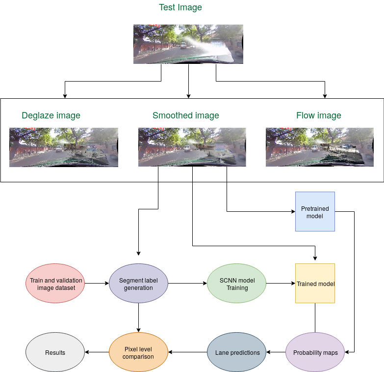

## Heuristic-Deglazing

We first aimed to deglaze images in our dataset using a heuristic based approach. We identified that the main glazed area of concern for lane detection belonged at the bottom portion of the image near the car panes. 
We then divided this bottom region in three windows and identify the glaze pixels using seperate thresholds for the three color channels. 
This is based on the assumption that the glazed pixels are saturated. Further, our selection of only the bottom pane for getting the glaze region helps us avoid saturation caused by sun in the images.
Now, we select only one of the windows as our glazed region, after which we try to interpolate the saturated pixels with neighbouring images. 
We replace the pixel values with nearest unsaturated frame. 

### Smoothing 
We later realised that replacing at the level of pixels added some noise, for which we use gaussian smoothing. 
These deglazed images were then used for training new model as described below. We also evaluated the results of these deglazed directly on pretrained model.   

## SCNN Training

We trained the deglazed images created above using the tensorflow based implementation provided by [SCNN-tensorflow](https://github.com/cardwing/Codes-for-Lane-Detection).
The model was trained on GPU machines provided by [Wisconsin Applied Computing Center](http://wacc.wisc.edu/).
The model for training takes as input the image files as well as their lane markings. The training requires per pixel labels, which are generated using a seperate 
method provided at [Seg_label_generate](https://github.com/XingangPan/seg_label_generate). 

Complete process flow

### Segment label generation
This method tries to fit a spline curve by extrapolating the already present manual markings, and write out the per pixel labels. It also identifies the coordinates of the lanes 
using the provided manual points. The authors of SCNN use the same method for their training and evaluation. 

The deglazed images were divided into validation, test and training sets contaning 100, 86, and 300 images respectively. 
We ran the training for 10000 iterations with intermittent checkpointing using a learning rate of 0.01 and nesterov momentum of 0.9. 
The GPU machines used were 4 Tesla V100-SXM2 with a memory fraction of 0.85. We trained the images in batch sizes of 8 using asynchronous training.
  
However, we observed that the number of images for training were very less and the model trained was not good. 
This calls for requirement of more data specific to glazing images to be able to perform training on them.

## Test methodology

We evaluate our results on both the pretrained model and our trained model created above.
For testing on our model, we used a random subset of 100 images sampled above. The models predict probabilities for presence of lane at each pixel in the images.
These probabilities map are then used to generate lane segment predictions. These lane predictions are then connected using spline curve fitting to form continous markings. 
The predicted lanes are compared with the labelled markings on a per-pixel basis, using the evaluation metric described below.    
  

## Optical flow

After evaluating our results on deglazed images, we observed some drawbacks in heuristic per-pixel replacement approach. Firstly, it adds noise in the image, which is difficult to remove even with smoothing. 
This also makes it difficult to fit the spline curve which may further affect our results, even if our predictions may be correct.
Second, it also may also lead to shift in predicted lane markings due to inherent motion present between neighbouring images. 
To overcome these, we tried the approach of using optical flow to incorporate the motion of car also while interpolating the pixels.
We tried three different approaches for find the optical flow between the images as described below.

### Methods:
#### 1. Horn-Schunck Method:
Horn Schunck method assumes that the optical flow is smooth over the entire image and computes an estimate of the velocity field that minimizes the equation:

$$
E = \int \int (I_xu + I_yv + I_t)^2dxdy + \alpha \int \int ((\frac{\partial u}{\partial x})^2 + (\frac{\partial u}{\partial y})^2 + (\frac{\partial v}{\partial x})^2 + (\frac{\partial v}{\partial y})^2)dxdy
$$

#### 2. Lucas-Kanade Method:
Lucas-Kanade method assumes that the flow is essentially constant in a local neighborhood window $W$ of the pixel under consideration and solves the basic optical flow equations for all the pixels in the neighborhood by least squares criterion. That is, for all points $(k, l) \in W$,
$$
I_x(k, l)u + I_y(k, l)v + I_t(k, l) = 0
$$

We used pre defined `estimateFlow()` method in MATLAB with `opticalFlowHS` for Horn-Shunck method and `opticalFlowLK` for Lucas-Kanade method for the `opticFlow` parameter. 

#### 3. Template-Matching Method:
In this method, for each template window $T$ in image $I_1$, first find the corresponding match in image $I_2$. Then the vector from the initial position to the final position of the corresponding points gives an estimate of optical flow at each point. We used Sum of Squared differences to compare the windows in image $I_1$ with the windows in image $I_2$.

We used the implementation from hw 7 for this.

### Approach to interpolate glaze pixels with optical flow:
After trying the three methods described above, we found that the template-matching based approach worked best for the approach. Now, the goal is to incorporate the motion of the vehicle while interpolating the pixels with historical images in the glaze region. Optical flow can give us an estimate of how much the vehicle has moved compared to the previous frame and thus instead of interpolating the pixels based on just the corresponding coordinates in the image, we can add the optical flow vector to each pixel in the glaze region to get an estimate of the new position of the historical pixel point in the image. 

For this, we need to determine the optical flow direction and magnitude. But the challenge is that we cannot directly estimate the optical flow of the glaze region as these images are saturated which results in noisy optical flow. Therefore, we employ certain heuristics to do the same. Firstly, it is important to observe that due to the movement of the vehicle in forward direction, the dominant optical flow direction of the image in outward direction from the center of the image. We have also discarded the directions that do not agree with this dominant direction as those optical flow vectors can be considered noise. That is in the top left part of the image, the optical flow is in the left top direction, and in the bottom right part of the image, the optical flow is in the right bottom direction. Therefore, we take the opposite region of glaze in the image and estimate the optical flow direction to be the opposite of the average of the opposite region. The below images illustrate this:

As it can be seen from the figure, since the glaze region is in the right bottom, the optical flow was computed for the left top region. Only the vectors in the left top direction are kept and the others are discarded. These can be seen as a needle plot in yellow color. We then take the average of all these vectors and the opposite direction of this vector is assumed to be the optical flow of the glaze region. This is depicted by a small red colored vector in the center of the image. The same is repeated for getting the optical flow direction of the glaze region. Once we get this information, we incorporate the same to interpolate the glaze region pixels.

